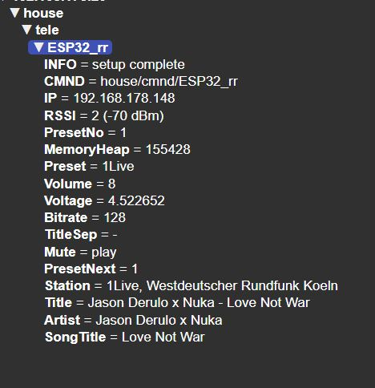

# LilyGo_T_Display_S3-Radio
Radio based on ESP32 S3 - LilyGo with Display 170x320

The prior version was developed in 2021 when platformio was based on arduino v2: https://github.com/ThomasH-W/ESP32-Radio-TTGO.
After moving to Arduino v3 basically nothing worked anymore and I had to re-establish the proejct setup from scratch using pioarduino.
In addition the guideline from schreibfaul1 did the final trick to get the fundamentals up and runnning again: https://github.com/schreibfaul1/ESP32_Arduino_ESPIDF/

The project is using an ESP32S3 with a better display. The Display is now attached to the board in a more solid way making it easier to mount into any housing.
https://www.lilygo.cc/products/t-display-s3

If you want to use a different board please keep in mind to use an ESP32 with PSRAM as it is required by https://github.com/schreibfaul1/ESP32-audioI2S.

# ESP32-Radio-TTGO
ESP32 Internet Radio with Display 

## Introduction
Existing radios or loudspeakers will be used in order to get decent sound quality.
The display should show relevant information and the font size should not be too small.

Most of the time you just want to switch the device on and listen to the music.
There are only two things you want to change: volume and radio station.
Nevertheless there is only one dial to cover both functions.

In addition there is a webserver including song covers as well as mqtt to allow integration into home automation.

## Operation
### Display
#### Default view

#### Select radio station
Selecting a new radio station is done async. I.e. you can scroll up and down in the list without delay but tuning to the new station will happen after 3 seconds.

 

#### Change Volume
When you turn the rotary encoder, the display is showing the volume.
After 3 secinds the display will revert back to the default screen.

### Webserver

### MQTT

### Node-RED

## Setup
### WiFi Manager
Upon first boot, the wifi  manager will start and ask for wifi credentials as well as mqtt setting.
### Radio Stations
10 stations can be configured using the four parameters below. PlatformIO: data/setup.ini
- RadioName = 1Live
- RadioURL = http://wdr-1live-live.icecast.wdr.de/wdr/1live/live/mp3/128/stream.mp3
- RadioTitleSeperator = -
- RadioTitleFirst = Artist

| Token               | Comment    |
| :----------         | :----- |
| RadioName           | A short name to be shown on the display |
| RadioURL            | url of the mp3 stream |
| RadioTitleSeperator | Some stations are using '/' or '-' to split artist and title |
| RadioTitleFirst     | Indicate if order is Title/Artist or Artist/Title |

## Hardware

Despite of the TTGO you need the audio decoder. Optional is a rotary encoder in order to change volume and stations.
Note: PINS are defined in GPIO_PINS.h

### Digital / Analog Converter – DAC
The PCM5102 is using the I2S interface.

| PCM5102     | ESP    |
| :---------- | :----- |
| P_I2S_LRCK  | Pin 43 |
| P_I2S_BCLK  | Pin 44 |
| P_I2S_DATA  | Pin 18 |

In addition you need to connect the following pins:

| PCM5102 | Wiring      | Comment |
| :------ | :---------- |:----- |
| FLT     | GND         | Filter Select. GND for normal latency|
| DEMP    | GND         | De-Emphasis control. Low = off|
| SMT     | GND         | Audio format. Low = I2S|
| XMT     | 10K -> 3V3  | Mute: pulled via 10k Resistor to 3,3V to un-mute|

### Rotary Encoder
The direction can be changed by swapping A + B.

| Encoder     | ESP    |
| :---------- | :----- |
| P_ENC0_A    | Pin 10 |
| P_ENC0_B    | Pin 11 |
| P_ENC0_BTN  | Pin 12 |
| P_ENC0_PWR  | Pin 13 |

## Software 

To install the software you need to create the binary and uplad the content of the data folder.

### MQTT
MQTT is optional. If you do not have an MQTT broker installed you can ignore all settings.
The radio will still work if the MQTT broker cannot be reached.
MQTT is used to provide a generic interface for e.g. home automation.
In addition NodeRED can be used to generate a simple user interface.

### PlatformIO

#### BINARY - Program Code

Create the binary from program code and upload
- Build
- Upload

### DATA - Filesystem

All files located in directory data need to be uploaded.
Please follow the guideline below:
  https://randomnerdtutorials.com/esp8266-nodemcu-vs-code-platformio-littlefs/ 

##### platformio.ini
- board_build.filesystem = littlefs

#### TFT_eSPI

Either copy the user files "User_Setup*" files or manual adjust as shown below.
- source: README\TFT_eSPI 
- target: PlatformIO\Projects\your-project-name\.pio\libdeps\lilygo-t-displays3\TFT_eSPI

##### User_Setup_Select.h
File: PlatformIO\Projects\TTGO-Radio\.pio\libdeps\esp32doit-devkit-v1\TFT_eSPI\User_Setup_Select.h

- // #include <User_Setup.h>
- #include <User_Setups/Setup206_LilyGo_T_Display_S3.h>     // For the LilyGo T-Display S3 based ESP32S3 with ST7789 170 x 320 TFT

#### setup.ini
Maintain your favorite radio stations (see above) in data/setup.ini

#### Build Filesystem and Upload Filesystem Image
Open the PlatformIO Menu on the top left and perform both steps: 
- Build Filesystem Image
- Upload Filesystem Image
Note: you may need to unplug/plugin your ESP to upload the image

## Setup

Once binary is uploaded to the ESP32 you need to power off/on.
After power on, device will create an access point.
Connect with your smartphone and select your WiFi network as well as settgin a device name.
Device will reboot and immediately connect to the first radio station.
